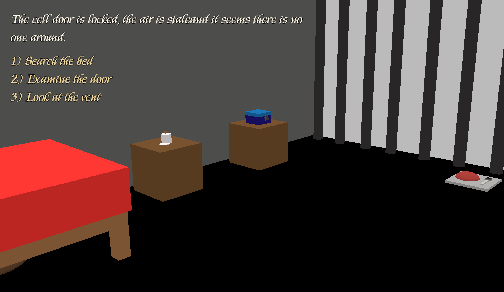

# Escape the Dungeon

Author: Ryan Lee

Design: Escape the Dungeon is an escape room game where you have to escape your cell by solving puzzles
        and finding items. The setting and solutions are unique and made specifically for this assignment.

Text Drawing: All text is shaped and rendered at runtime by my TextRenderer (TextRenderer.hpp/cpp).
        The first time a glyph is needed it is rasterized by FreeType and packed into a single atlas texture which holds all the glyphs.
        This makes cost a lot more efficient because we aren't rasterizing every single glyph every time, only once when we first use it.
        Then, each word is shaped with HarfBuzz to get glyph indices and spacing which the function layout() uses for word wrapping
        and new lines. Drawing a glyph uses a shader that treats the atlas's red channel as the alpha so the text can be any color.
        Also, the glyph sizes are scaled to the screen size so even if the game window is windowed or full screen, the words
        should take up the same amount of space.

//Structure of FreeType/HarfBuzz setup + shaping based on:
//  https://github.com/harfbuzz/harfbuzz-tutorial/blob/master/hello-harfbuzz-freetype.c
//Glyph rasterization based on the FreeType tutorial:
//  https://www.freetype.org/freetype2/docs/tutorial/step1.html

Choices: The game's story is run by my Story.cpp code which stores the narrative and all the choices.
         The story is made up of different nodes, which are just different stages in the story with their own choices.
         Each node consists of the text to display and the choices that are available to the player and this file also
         keeps track of flags (choice results) so you can have it show certain choices is only the precondition are met.
         Each node also has an associated camera for its view. This modularity makes it really easy to add new nodes
         or to modify existing ones.

Screen Shot:

How To Play:

This is an escape room where you are given a number of choices you can make at each state.
Your goal is to escape the cell by getting a key to open the door.
Each state will have a list of choice you can make with a number associated to it.
To make that choice just press that number on your keyboard.

Sources:
Kings Font designed by Robert Leuschke. Downloaded from Google Fonts and are licensed under the Open Font License
https://fonts.google.com/specimen/Kings?preview.script=Latn

This game was built with [NEST](NEST.md).

***** ANSWER TO ESCAPE ******
***** SPOILERS **************

Find spoon from your food near the door -> dig up the dirt under the bed to find the drill
Take all the balls to find the code -> Use the code to open the chest to find the handle
Combine the drill and handle to create a screwdriver -> Open the vent cover to find the key mold
Bring the key mold to the candle -> Use the wax to create a key
Take the key to the door -> Open the door with the key and escape